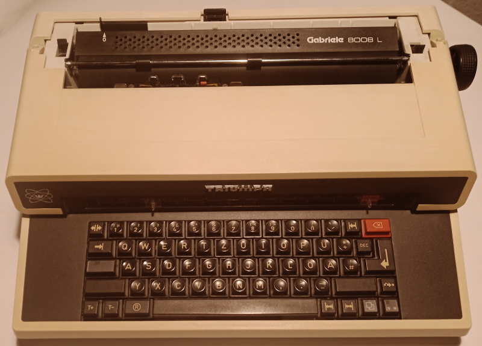

========================================
Build a cyberdeck from an old typewriter
========================================

After reading about another crazy `cyberdeck build on Hackaday <https://hackaday.com/blog/?s=cyberdeck>`_ I bought an old typewriter on Ebay
(15€ including shipment) to try it as well.

A Triumph Adler Gabriele 8008L

Links
=====

* https://deskthority.net/viewtopic.php?f=63&t=6648
* https://geekhack.org/index.php?topic=49641
* https://github.com/koron/matrixscan
